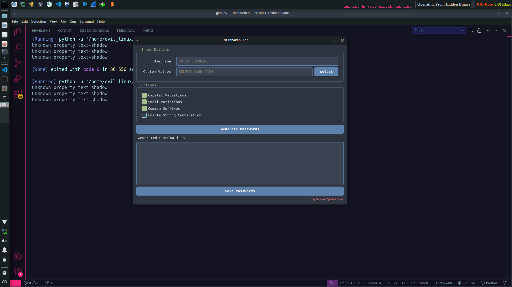

# MiXhrakah 777 – Password Generator

A modern **gui desktop application** for generating customized password combinations.  

---

## Features

- Generate password variations from:
  - Username
  - Custom values (file input text)
- Options:
  - Capital variations  
  - Small variations  
  - Common suffixes (years, numbers, etc.)  
  - Strong combination mode (hard merges of values)
- View generated passwords inside the app
- Save generated lists as `.txt`
- Clean, modern **Nord-inspired theme**
- Easy-to-use GUI (PyQt5)

---

## 📸 Screenshots


---

## ⚙️ Installation

1. Clone the repository:
   ```bash
   git clone https://github.com/BharatCyberForce/MiXhrakah.git
   cd MiXhrakah
   pip3 install -r requirements.txt
   python3 mixhrakah.py
